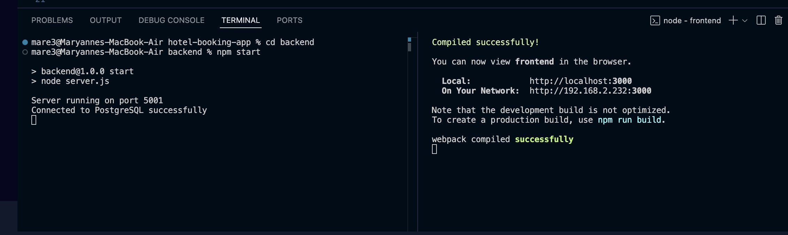

# hotel-booking-app

Pre-set-up: npm install (when first cloning repo)

2 ways to run:
first way - two terminals:
    (have to open two terminals at the same time) 

    first terminal:
    - cd backend 
    - npm start
    - http://localhost:5001/room

    second terminal:
    - cd frontend
    - npm start

    

second way - using command:
    - open new terminal
    - use command "npm install concurrently --save-dev"
    - npm start

To reach our admin page with the admin database, emlpoyee sign in is: SSN/SIN: 123, Password: 123
To go through customer sign in (although our regular user page with no sign in is the same as our customer sign in page), username: 321, password: 321